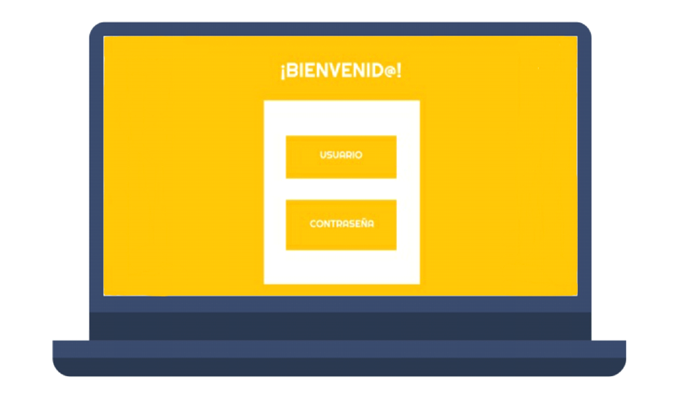
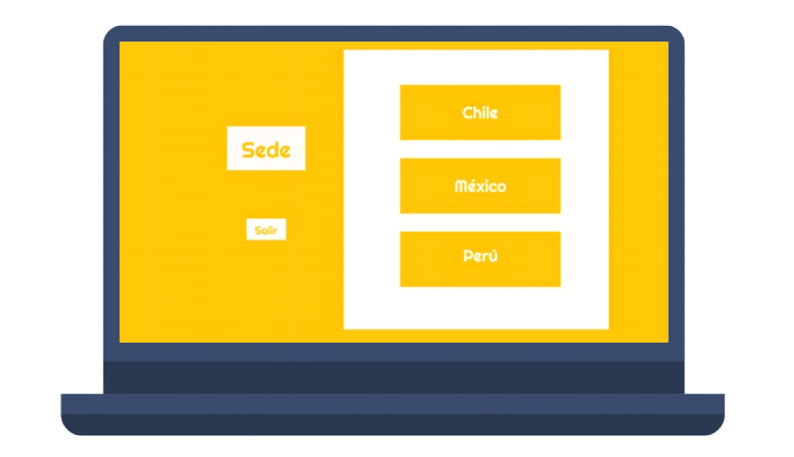
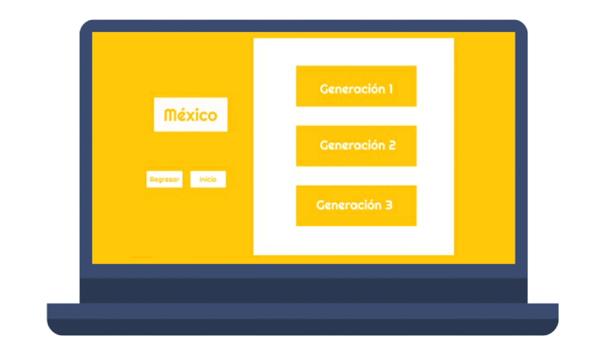
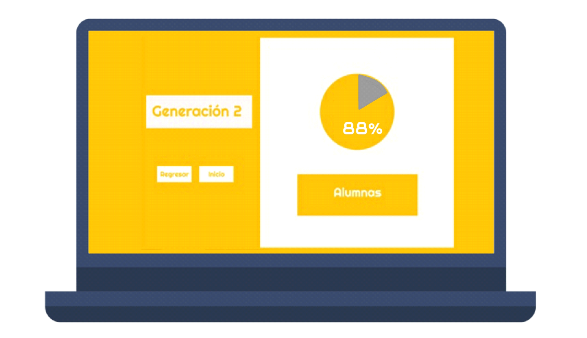
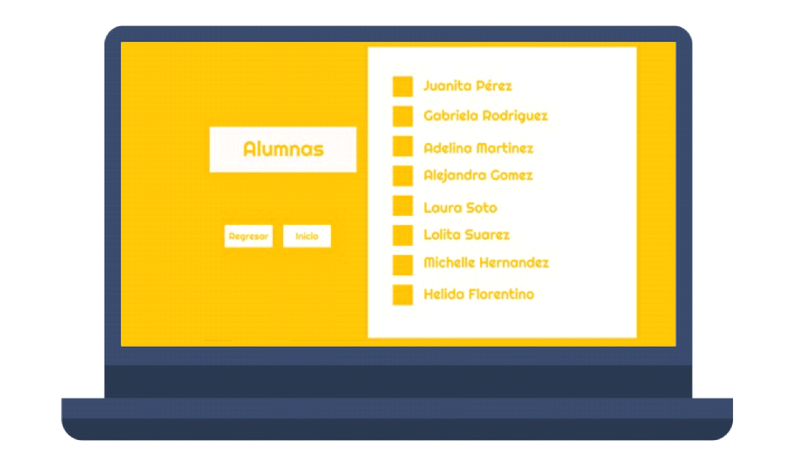
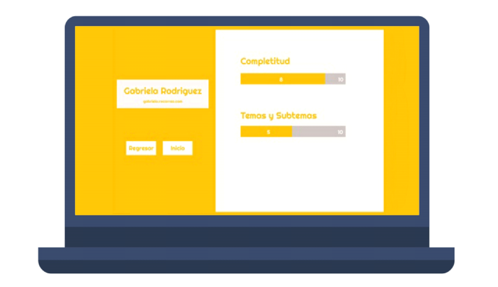

# **Data Dashboard**

## **Proceso de UX**

## **Definición del producto.**

Los Training Managers (TMs) están enfocados en la formación del talento de una empresa. Una de sus mayores responsabilidades es comprender las nuevas tendencias para “diseñar un programa de formación acorde a las nuevas generaciones”.
En Laboratoria, las TMs son de suma importancia a la hora de reconocer el talento de las alumnas. Por lo anterior y para facilitar el trabajo que realizan, se pretende crear una interfaz donde puedan ver y usar la información que se registra de la comunidad educativa. En otras palabras, servirá para analizar la data, tomar decisiones y crear estrategias. Así pues, tendrán una mejor interacción con la información obtenida, y podrán tener una mejor organización en su registro de actividades y una mayor eficiencia.
Se realizaron entrevistas a las TMs, tanto presencialmente como a través de correos electrónicos y audios, las respuestas fueron:

Para el sketch se realizaron dos versiones, una a mano con lápiz y papel, y otra digital en Figma:

# **Data Dashboard**

## **Proceso de UX**

Nuestro primer acercamiento lo haremos a través del proceso de diseño, donde pasamos por diferentes etapas como:

### **1. Descubrimiento e investigación**
(En esta fase es donde vamos a tener ese proceso de investigación y acercamiento con el usuario, es donde vamos a obtener el conocimiento para poder saber a quién vamos a llegar, pero de manera más profunda. Es tener la empatía y el acercamiento necesario para conocerlo.

También vamos a tener en cuenta al negocio, sus objetivos y a los stakeholders(involucrados)).

__Usuarixs:__  (Toda la información que sepas de ellxs, ya sea porque las has podido observar o porque obtuviste datos directamente de ellas)

__Necesidades de las usuarias:__

__Objetivos de las usuarias:__ (Lo que quieren o esperan lograr)

__Pain points:__ (En sus actividades diarias qué es lo que más les molesta u obstaculiza en el proceso de  realizar sus actividades/objetivos)

__Sentimientos:__(Sentimientos que les surgen dentro del proceso de sus actividades. Identificar cuáles predominan)

__Técnicas usadas en esta fase:__ (Sabemos que en este punto, tal vez, sólo has ocupado encuestas, no te olvides de documentar este proceso de recolección de datos)

__5. Objetivos del negocio:__ (Enlistarlo(s))

__6. Motivaciones del negocio para el data dashboard:__(Enlistarlo(s))

### **2. Síntesis y definición**
(Dada la fase anterior de investigación, ahora vamos a tomar todos los datos más importantes y transformarlos en información valiosa para comenzar a orientarse a la solución. También vamos a entender lo que la empresa quiere de ese producto y comenzar a entender ambas visiones con el fin de encontrar un punto armónico)

__1. Cuáles crees que son los datos más importantes a tener en cuenta para el Data Dashboard:__

   - Sobre las estudiantes:

__2. Lo que los usuarios esperan obtener:__

__3. Insights:__

__4. Data proporcionada:__

     -_Data relacionada a los cursos:_

__5. Insights del negocio:__

### **3. Ideación**
(Acá se comienza a pensar esa solución tomando en cuenta la información recopilada y procesada)

### **4. Prototipado**
(Esta es la fase creativa, donde se comienza a construir el Data dashboard con la información obtenida de las fases anteriores. Se reafirma crear la experiencia de usuario, donde la solución resuelve necesidades y facilita la vida)

Sketch: (Adjuntar liga)

Prototipo en figma: (Adjuntar liga)

### **5. User testing**
(Si deseas validar tu propuesta, acércate a tu usuario y que te de feedback con el fin de mejorar tu producto en beneficio del negocio y de tu usuarix).
****
